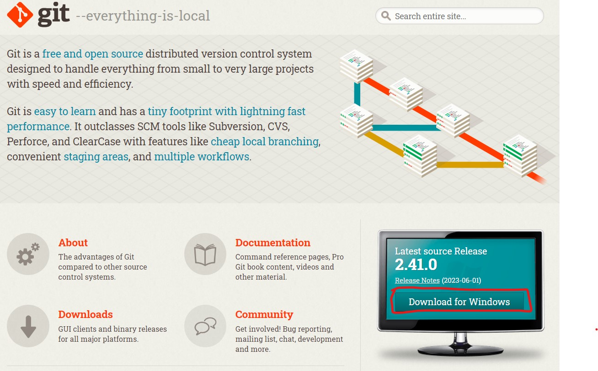
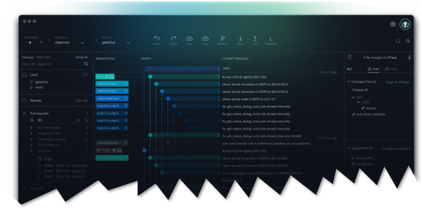
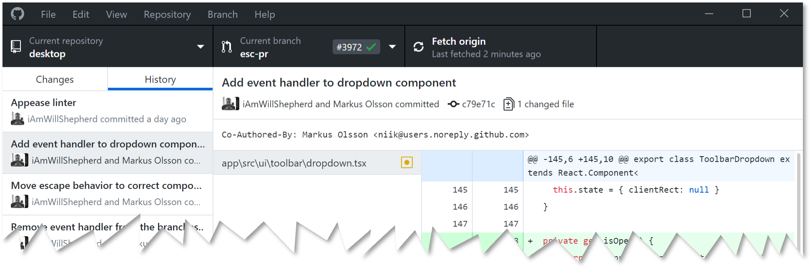

# Your Gateway to Collaboration & Version Control  
>>>### Empower Your Development Workflow with GitHub

## Table of content
- [Introduction](https://github.com/Nithy29/The-GitHub.git#introduction) 
- [Deeper look at DUO](https://github.com/Nithy29/The-GitHub.git#deeper-look-at-DUO) 
- [Navigating Git Ecosystem](https://github.com/Nithy29/The-GitHub.git#navigating-git-ecosystem) 
- [Key Features of GitHub](https://github.com/Nithy29/The-GitHub.git#key-features-of-gitHub)
- [Collaboration Workflow](https://github.com/Nithy29/The-GitHub.git#collaboration-workflow)
- [GitHub in Action](https://github.com/Nithy29/The-GitHub.git#gitHub-in-action)
- [Conclusion](https://github.com/Nithy29/The-GitHub.git#conclusion)
- [License](https://github.com/Nithy29/The-GitHub.git/blob/main/LICENSE)
 

## Introduction

In the landscape of collaborative software development, the need for efficient sharing and seamless collaboration with team members has become paramount. The dynamic duo of Git and GitHub has revolutionized this process. 

<u>_**Diving Deeper into GitHub**_</u>
>For the purpose of our discussion, our focus will primarily be on GitHub and how it amplifies collaborative development.

## Deeper look at DUO 

>**Git: Empowering Collaborative Development**

>>At its core, _**Git**_ is a potent distributed, open-source version control system that has earned widespread acclaim for its role in tracking codebase changes and facilitating effective collaboration. Proficiency in Git is an essential asset for driving efficient software development.

>**GitHub: Unveiling the Power of Cloud-based Development**

>>_**Enter GitHub**_, a cloud-based software development hosting service that leverages the capabilities of Git for version control. It extends its reach by offering a cloud-based repository environment tailored for your projects. This dynamic approach streamlines collaborative efforts by furnishing an online hub to store, manage, and share code repositories seamlessly with your teams and beyond.

## Navigating Git Ecosystem

   Interacting with Git manifests through two prominent pathways, each catering to diverse preferences:

- [Terminal Interface](https://git-scm.com/downloads): Anchored in a text-based environment akin to Unix/Linux shell or Git Bash, this command-line interface holds sway among seasoned developers who relish its efficiency and power.
 

- GUI Interface: For those inclined towards graphical interfaces, options like [Git Desktop](https://desktop.github.com/) or [GitKraken](https://www.gitkraken.com/) offer an inviting visual representation. Geared toward newcomers and users who prefer Windows-based platforms, GUI interfaces seamlessly integrate Git commands within a user-friendly environment.
 
  

In this discussion, we will uncover the nuances of GitHub and its role in fostering collaboration, streamlining workflows, and propelling software development endeavors to new heights.

## Key Features of GitHub

GitHub offers a plethora of features that enhance collaboration, streamline development workflows, and promote community engagement. Let's look at some of these features:

<ol type="i">
<li><b>Collaboration and Showcase:</b></li>
    <ul class="sub-bullets">
        <li>GitHub Profiles: A platform for showcasing projects, contributing to collaboration, and demonstrating expertise. Valuable for data scientists and other professionals to exhibit their work experience. This can be counted as their work experience towards their resume</li>
    </ul>
<li><b>Open-Source Ecosystem:</b></li>
    <ul class="sub-bullets">
        <li>Sponsorship: Support maintainers financially, contribute to open-source projects, and use open-source tools in your own projects.</li>
        <li>Contribution: Engage in discussions, make feature requests, contribute code and documentation, fostering a thriving open-source community.</li>
    </ul>
<li><b>Community Collaboration:</b></li>
    <ul class="sub-bullets">
        <li>Issues and Discussions: A space for discussing issues, suggesting improvements, and proposing solutions collaboratively.</li>
    </ul>
<li><b>Discover and Explore:</b></li>
    <ul class="sub-bullets">
        <li>GitHub Explore: Discover trending projects, tools, and developer events to stay up-to-date with the latest advancements.</li>
    </ul>
<li><b>Code Sharing and Embedding:</b></li>
    <ul class="sub-bullets">
        <li>GitHub Gists: Share code snippets with others or embed them in blogs and websites for easy dissemination.</li>
    </ul>
<li><b>Command Line Integration:</b></li>
    <ul class="sub-bullets">
        <li>GitHub CLI: Efficiently manage pull requests, code reviews, issue tracking, and monitoring directly from the command line.</li>
    </ul>
<li><b>Unlimited Repositories:</b></li>
    <ul class="sub-bullets">
        <li>Free Storage: GitHub offers unlimited storage for both private and public repositories, allowing you to manage your projects without limitations.</li>
    </ul>
<li><b>Web Hosting and Publishing:</b></li>
    <ul class="sub-bullets">
        <li>GitHub Pages: Easily create, build, and deploy websites, portfolio sites, or documentation using GitHub's user-friendly hosting platform.</li>
    </ul>
<li><b>Integrated Cloud Development:</b></li>
<ul class="sub-bullets">
        <li>Codespace: A cloud-based development environment seamlessly integrated with your GitHub repository, enabling collaborative coding from anywhere.</li>
    </ul>
<li><b>Project Management:</b></li>
    <ul class="sub-bullets">
        <li>GitHub Projects: A flexible tool for planning, tracking, and managing work directly within GitHub, enhancing team collaboration.</li>
    </ul>
<li><b>Workflow Automation:</b></li>
    <ul class="sub-bullets">
        <li>GitHub Actions: Automate various development tasks like building, testing, publishing, releasing, and deploying workflows, enhancing efficiency.</li>
    </ul>
<li><b>Developer Support:</b></li>
    <ul class="sub-bullets">
        <li>Sponsorship Options: Support your favorite projects and developers through recurring or one-time payments, leveraging third-party platforms like ko-fi.</li>
    </ul>
</ol>

These features collectively make GitHub an indispensable platform for developers, data scientists, and professionals seeking effective collaboration, open-source contributions, and efficient development workflows.

## Collaboration Workflow

GitHub offers a versatile and collaborative workflow that facilitates efficient collaboration among team members while maintaining code quality and project integrity. Here's a breakdown of the GitHub collaboration workflow:

<ol type="i">
<li><b>Forking the Repository:</b></li>
		<ul class="sub-bullets">
			<li>A team member forks the main repository to create their copy of the project.</li>
<li>The forked repository resides in their GitHub account and serves as their development workspace.</li>
		</ul>
<li><b>Cloning the Fork: </b></li>
		<ul class="sub-bullets">
<li>The team member clones their forked repository to their local machine using Git. </li>
<li>This provides them with a local copy of the project to work on. </li>
		</ul>
<li><b>Creating a Feature Branch: </b></li>
		<ul class="sub-bullets">
<li>The team member creates a new branch in their local repository to work on a specific feature, bug fix, or enhancement. </li>
<li>Using branches keeps the main codebase clean and allows for parallel development. </li>
		</ul>
<li><b>Developing and Committing Changes: </b></li>
		<ul class="sub-bullets">
<li>The team member makes code changes in their feature branch.
<li>They commit their changes with meaningful commit messages, documenting their work. </li>
		</ul>
<li><b>Pushing Changes to the Fork: </b></li>
		<ul class="sub-bullets">
<li>The team member pushes their committed changes to their forked repository on GitHub. </li>
		</ul>
<li><b>Creating a Pull Request (PR): </b></li>
		<ul class="sub-bullets">
<li>From their forked repository on GitHub, the team member initiates a pull request. </li>
<li>The pull request proposes merging the changes from their feature branch into the main repository's branch (often the main or master branch). </li>
		</ul>
<li><b>Code Review: </b></li>
		<ul class="sub-bullets">
<li>Other team members review the pull request's code changes, providing feedback and suggestions. </li>
<li>Code reviews help maintain code quality, catch errors, and ensure adherence to coding standards. </li>
		</ul>
<li><b>Addressing Feedback and Revising: </b></li>
		<ul class="sub-bullets">
<li>Based on the feedback received during the code review, the original contributor makes necessary changes, commits them, and pushes to the same feature branch in their fork. </li>
		</ul>
<li><b>Continuous Integration (CI) Checks: </b></li>
		<ul class="sub-bullets">
<li>GitHub Actions or other CI tools automatically run tests and checks on the code changes within the pull request. </li>
<li>These checks ensure that the proposed changes do not introduce new issues or break existing functionality. </li>
		</ul>
<li><b>Merging the Pull Request: </b></li>
		<ul class="sub-bullets">
<li>Once the changes have passed code review and CI checks, a project maintainer or designated reviewer merges the pull request into the main repository's branch. </li>
		</ul>
<li><b>Closing the Pull Request: </b></li>
		<ul class="sub-bullets">
<li>The merged pull request is closed, and the changes are now part of the main codebase. </li>
<li>The feature branch can be safely deleted. </li>
		</ul>
<li><b>Updating the Local Repository: </b></li>
		<ul class="sub-bullets">
<li>Other team members update their local repositories to include the latest changes from the main repository. </li>
		</ul>
</ol>

This workflow supports collaboration, parallel development, thorough code review, and automated testing. It promotes efficient development processes while maintaining code quality and project stability.

## GitHub in Action

GitHub, as a versatile collaboration platform, plays a pivotal role in hosting a diverse range of projects that highlight its exceptional utility in modern development workflows. Through real-world examples, we can witness how GitHub empowers developers, teams, and communities to collaborate seamlessly and innovate collectively.
1.	_**Open-Source Software Development:**_ GitHub is the heartbeat of open-source projects. Thousands of developers worldwide contribute to shared repositories, enabling the creation of high-quality software accessible to all. From the Linux kernel to the TensorFlow machine learning library, open-source projects on GitHub exemplify global collaboration and code transparency.
 
2.	_**Web Development and Design:**_ For web developers, GitHub offers a platform to showcase their skills and collaborate on website development. Teams can collaboratively work on HTML, CSS, and JavaScript code, design elements, and responsive layouts. The integration of version control ensures precise tracking of changes and seamless teamwork.
 
3.	_**Data Science and Research:**_ GitHub extends its reach beyond coding to encompass data science projects. Here, teams can collaborate on Jupyter notebooks, share datasets, and create reproducible analyses. The platform's version control ensures that data-driven research remains transparent and easily auditable.
 
4.	_**Documentation and Technical Writing:**_ Documentation is crucial for any project's success. GitHub provides an efficient platform for teams to collaboratively create, review, and maintain documentation. Markdown support, pull requests, and issue tracking enable seamless content development.
 
In essence, "GitHub in Action" showcases the diverse ways GitHub facilitates collaboration across domains. Whether it's writing code, building websites, analyzing data, or documenting projects, GitHub serves as the central hub for individuals and teams to collaborate effectively, share knowledge, and drive innovation forward.

## Conclusion 

   <b>The Evolutionary Impact of GitHub</b>

In the landscape of modern software development, GitHub stands as a testament to the transformative power of collaboration. Through its intuitive version control, robust issue tracking, seamless pull request system, and integration of automation, GitHub has revolutionized how individuals and teams work together to create exceptional software. As the ultimate platform for sharing, reviewing, and enhancing code, GitHub fosters a culture of transparency, inclusivity, and continuous improvement. It has become the virtual nexus where developers worldwide converge to contribute to open-source projects, build innovative solutions, and collectively shape the future of technology. In this digital age, GitHub's influence extends beyond code repositories; it embodies a spirit of community-driven progress that empowers us all to learn, grow, and collaborate on a global scale.

  

## Learning Resources

- [Git Command Summary](gitHub.md) 

- Learn Git In 15 Minutes 
- The git Workflow under a Microscope 
- When Your Development Takes a Detour 
- Communicating with Developers of the Future 

  

📔 Contact: 📩 sarvanvel@gmail.com

    
